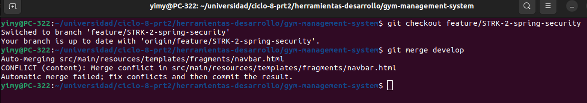
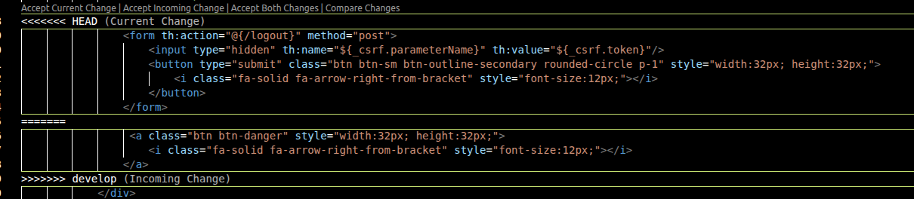
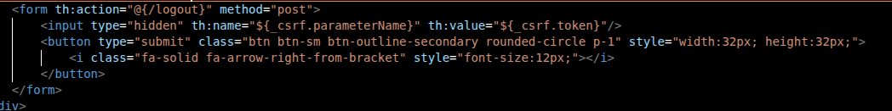
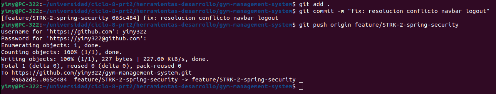
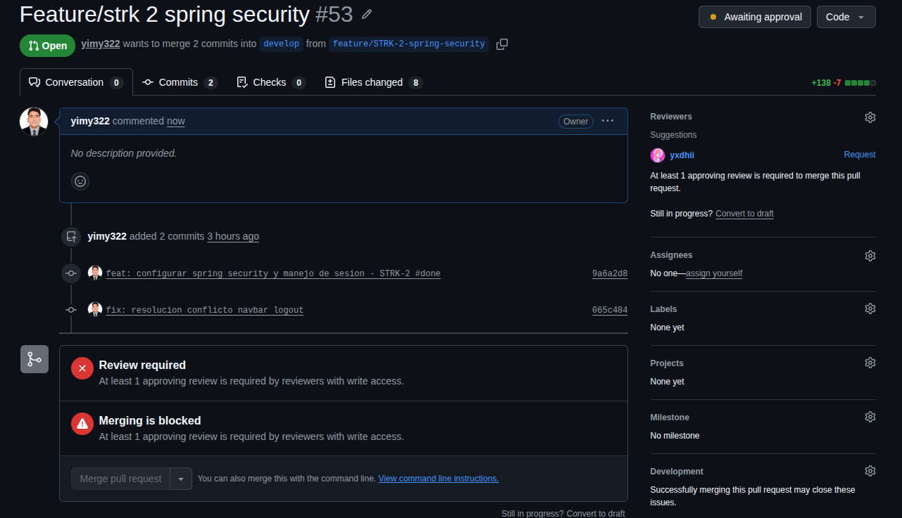

## Resolución de conflictos

Al intentar traer los cambios de develop a nuestra rama `feature/STRK-2-spring-security` nos salió un conflicto.

Identificamos el archivo que tiene el error.

Como queremos conservar el cambio que hicimos en la rama actual, lo corregimos.
Y quedaría así:

Luego agregamos el archivo que corregimos y hacemos un commit indicando la resolución del conflicto y subimos el cambio.

Y listo, ahora ya podremos hacer el PR sin conflictos.

